# The Autumn Pattern

The Autumn pattern is a billing architecture where PayMongo is the **source of truth** for payments, but you don't rely on webhooks.

## Why "Autumn"?

Named after the [Autumn billing service](https://useautumn.com) that pioneered this pattern. Instead of waiting for webhook notifications, payment status is verified **on-demand** when users access features.

## How It Works

<Steps>
  <Step title="Attach">
    Create a PayMongo checkout session and redirect the user
  </Step>
  <Step title="User Pays">
    User completes payment on PayMongo's hosted checkout
  </Step>
  <Step title="Redirect">
    User returns to your success URL with `?ref=xxx` parameter
  </Step>
  <Step title="Verify">
    Call `/verify` endpoint to confirm payment and create usage records
  </Step>
  <Step title="Check">
    On feature access, check usage records in database
  </Step>
  <Step title="Track">
    Decrement usage for metered features
  </Step>
</Steps>

## Flow Diagram

```mermaid
sequenceDiagram
    participant User
    participant App as Your App
    participant DB as Database
    participant PM as PayMongo

    User->>App: Click "Subscribe"
    App->>PM: POST /checkout_sessions
    PM-->>App: checkoutUrl, sessionId
    App->>DB: Store session (pending)
    App-->>User: Redirect to PayMongo

    User->>PM: Complete payment
    PM-->>User: Redirect to successUrl?ref=xxx

    User->>App: Return with ref param
    App->>App: POST /verify
    App->>PM: GET /checkout_sessions/{id}
    PM-->>App: payment_status: paid
    App->>DB: Create usage records
    App-->>User: Subscription active ✓

    User->>App: Use metered feature
    App->>App: POST /track
    App->>DB: Decrement balance
    App-->>User: Usage recorded
```

## Benefits

<CardGroup cols={2}>
  <Card title="No Webhooks" icon="webhook">
    No public endpoints needed. No webhook signature verification. Simpler infrastructure.
  </Card>
  <Card title="Always Accurate" icon="check-circle">
    Payment status is checked at access time, not when a webhook arrives.
  </Card>
  <Card title="Verify on Return" icon="check-circle">
    Payment is verified when user returns via `/verify` endpoint. No polling needed.
  </Card>
  <Card title="Database-Backed" icon="database">
    All billing state stored in your database. No external state to sync.
  </Card>
</CardGroup>

## Period Rollover

Billing periods reset automatically when you call `/check`:

1. If `periodEnd < now`, the balance resets to the plan limit
2. New period starts from the current date
3. `periodEnd` is set based on the plan interval (monthly/yearly)

This means you don't need cron jobs or scheduled tasks. The reset happens lazily when the user accesses a feature.

## Trade-offs

<Warning>
  The Autumn pattern works best for subscription-based billing. For usage-based billing with real-time metering, webhooks may still be needed.
</Warning>

| Aspect | Autumn Pattern | Webhook Pattern |
|--------|----------------|-----------------|
| Infrastructure | Simpler | More complex |
| Latency | Slightly higher (API call) | Lower (pre-fetched) |
| Reliability | Self-healing | Depends on webhook delivery |
| Real-time | On-demand | Event-driven |
| Best for | Subscriptions, feature flags | Usage-based, real-time billing |
